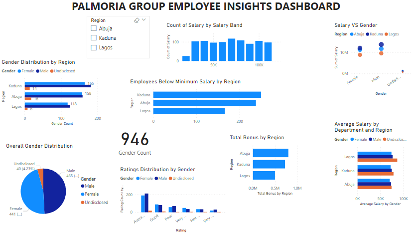

# powerbi-salary-analysis
A Power BI report analyzing employee salary structure, performance ratings, and gender pay gap.
# Palmoria Group Employee Insights: Gender, Salary, and Performance Analytics

This Power BI project explores key HR metrics using employee data from Palmoria Group. It analyzes demographic distribution, salary structure, performance ratings, and bonus calculations to uncover trends, gaps, and actionable insights.

## 🔍 Project Focus Areas

1. **Gender Distribution**
   - Bar chart of employee gender across regions
   - Pie chart of overall gender breakdown

2. **Performance Ratings by Gender**
   - Histogram of rating distribution
   - Average rating by gender
   - Box plot comparison of performance by gender

3. **Salary Structure & Pay Gap**
   - Scatter plot showing salary vs. gender
   - Average salary by department and region
   - Gender-based salary gap measures

4. **Minimum Salary Threshold Analysis**
   - Histogram of salaries in $10,000 bands
   - Bar chart of employees earning below $90,000 by region

5. **Bonus Payment Calculation**
   - Bonus based on performance (ratings above 3)
   - Total salary + bonus per employee
   - Bonus payout by region

## 🛠️ Tools & Techniques

The final report is an interactive dashboard divided across multiple pages to clearly present:
- Workforce distribution
- Salary insights
- Performance-based rewards
- Regional pay disparities

## 📁 Files

- ['DSA Project.pbix'(./DSA%20Project.pbix) — Power BI report
- ## 📷 Sample Visuals

### 1. Gender Distribution by Region and Overall
This visual shows the count and proportion of male and female employees by region.

---

### 2. Ratings by Gender
Displays how performance ratings are distributed and compared between male and female employees.

---

### 3. Salary Structure and Pay Gap
Scatter plot and bar chart analyzing average salaries by gender, department, and region.

---

### 4. Minimum Salary Threshold
Histogram in $10,000 bands showing where employees fall, and how many earn below $90,000.

---

### 5. Bonus Payouts by Performance
Bonus calculated for employees with high ratings, visualized per region and in an employee breakdown table.

---

### 6. Dashboard Overview (Optional)
A full-page layout showing all key insights and slicers for interactivity.

## 👤 Author

**[Prince Obi]**  

